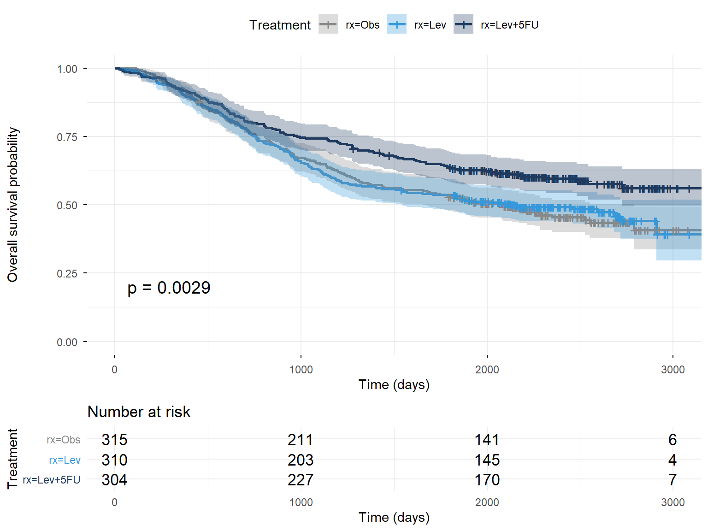
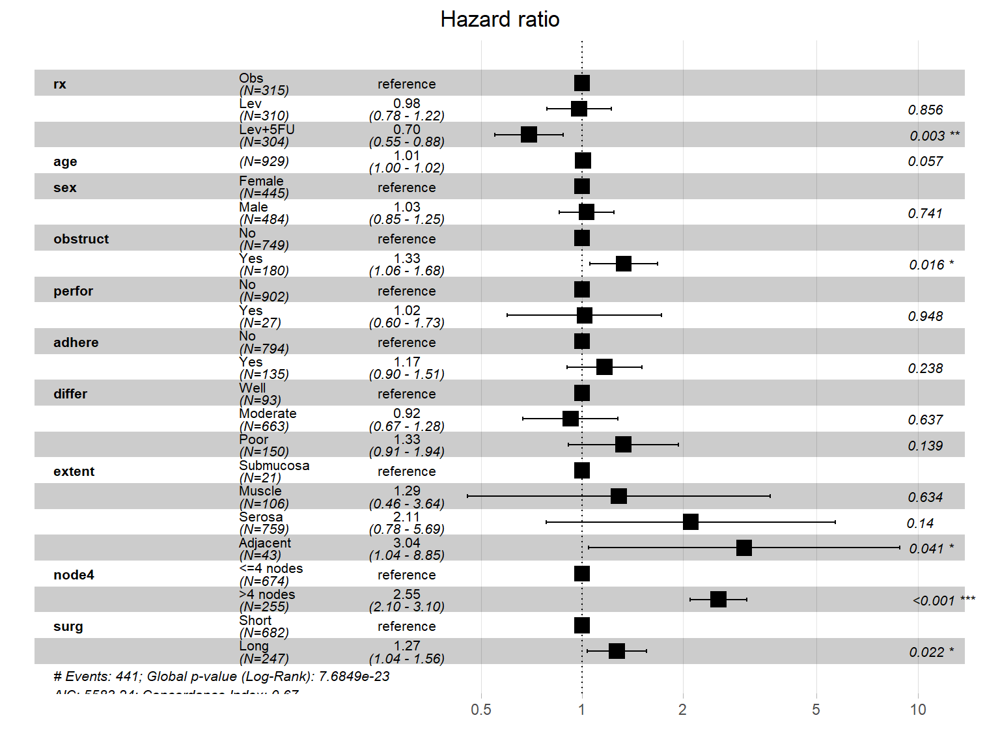

# Survival Analysis of the Colon Cancer Adjuvant Therapy Trial

Reproducible survival analysis of the `colon` dataset from the R `survival` package — the Moertel et al. (1990) trial that established 5-FU + levamisole as adjuvant therapy in resected stage III colon carcinoma.

**Personal project** demonstrating end-to-end survival analysis in R: data preparation and endpoint definition, non-parametric estimation, multivariate regression, assumption diagnostics, and fully reproducible reporting under version control.

📄 📄 [**Read the full analysis report**](https://voltyre.github.io/colon-cancer-survival-analysis/)

------------------------------------------------------------------------

## Objectives

- Reproduce the survival benefit of levamisole + 5-FU versus observation alone

- Determine whether the benefit is attributable to the combination or to levamisole as a single agent

- Build a multivariate Cox model adjusting for established prognostic factors

- Test the proportional hazards assumption formally, and report the result rather than assume it

  

## Produce a fully reproducible HTML report with pinned dependencies

## Study context

The data come from **INT-0035**, an intergroup randomised trial run by the North Central Cancer Treatment Group, the Southwest Oncology Group and the Eastern Cooperative Oncology Group, in patients who had undergone curative-intent resection of colon carcinoma within the preceding one to five weeks.

|  |  |
|------------------------------------|------------------------------------|
| Eligible disease | Locally invasive (stage B2) or node-positive (stage C) colon carcinoma |
| Arms | Observation · levamisole alone · levamisole + fluorouracil |
| Levamisole | 50 mg orally three times daily for 3 days, repeated every 2 weeks for 1 year |
| Fluorouracil | 450 mg/m² IV daily for 5 days, then weekly for 48 weeks from day 28 |
| Enrolled (published trial) | 1 296 patients |
| Median follow-up at publication | 3 years (range 2 to 5.5) |

**Why the treatment arms are unbalanced.** Only stage C patients were eligible for randomisation to levamisole alone; the observation and combination arms drew from both stage groups. The resulting asymmetry in `rx` is a feature of the trial design, not an anomaly of the randomisation.

**Published effect estimates**, against which the analysis below can be benchmarked: among stage C patients, the combination reduced the recurrence risk by 41 % and the overall death rate by 33 %. Results in stage B2 disease were equivocal at the time of the 1990 report.

**Scope of this dataset.** The published trial enrolled 1 296 patients; `survival::colon` contains 929. The dataset is therefore a subset of the trial population, and the exact derivation is not documented in the package. This bounds any comparison with the published figures — see [Limitations](#limitations).

------------------------------------------------------------------------

## Data

`survival::colon` contains 929 patients randomised to observation, levamisole alone, or levamisole + 5-fluorouracil following curative resection of stage III colon carcinoma. The dataset ships with the `survival` package, so no raw data file is stored in this repository and the analysis is reproducible from the lockfile alone.

> **Critical preprocessing step.** The dataset holds **two rows per patient**: one for recurrence (`etype == 1`) and one for death (`etype == 2`), giving 1 858 rows for 929 individuals. An analysis that omits this filter treats each patient as two independent observations, which deflates standard errors and inflates significance without producing any visible warning. This project uses the **overall survival endpoint** (`etype == 2`) and applies the filter before any modelling.

|                       |                                       |
|-----------------------|---------------------------------------|
| Endpoint              | Overall survival (`etype == 2`)       |
| Patients              | 929                                   |
| Deaths                | 452(48.7 %)         |
| Observation arm       | n = 315, 168 deaths |
| Levamisole arm        | n = 310, 161 deaths |
| Levamisole + 5-FU arm | n = 304, 123 deaths |
| Median follow-up      | 6.44 years          |

**Missing data.** Tumour differentiation (`differ`) contains missing values. The Cox models are fitted on complete cases, so the multivariate model uses **n = 906** patients against 929 for the Kaplan-Meier analysis. No imputation was performed; this is reported as a limitation rather than concealed.

### Covariates

| Variable | Coding | Description |
|------------------------|------------------------|------------------------|
| `rx` | Obs / Lev / Lev+5FU | Treatment arm (reference: Obs) |
| `age` | continuous, years | Modelled as linear on the log-hazard scale |
| `sex` | Female / Male |  |
| `obstruct` | No / Yes | Bowel obstruction by tumour |
| `perfor` | No / Yes | Colon perforation |
| `adhere` | No / Yes | Adherence to adjacent organs |
| `differ` | Well / Moderate / Poor | Tumour differentiation |
| `extent` | Submucosa / Muscle / Serosa / Adjacent | Depth of local spread |
| `node4` | ≤4 / \>4 nodes | More than four positive lymph nodes |
| `surg` | Short / Long | Time from surgery to registration |

`nodes` (the continuous node count) was deliberately excluded. It is the variable from which `node4` is derived, and including both would introduce structural collinearity that inflates standard errors on two of the strongest prognostic terms in the model.

------------------------------------------------------------------------

## Methods

The analysis proceeds from non-parametric description to adjusted inference, then verifies the assumption on which that inference depends.

- **Kaplan-Meier estimator** for survival curves, with 95 % confidence bands and numbers-at-risk tables

- **Log-rank test** across the three treatment arms, followed by pairwise contrasts against observation

- **Cox proportional hazards regression**, univariate on treatment then multivariate with adjustment for the covariates above

- 

  ## **Schoenfeld residuals** (`cox.zph`) to test proportional hazards globally and per covariate, with graphical inspection of the scaled residuals against time

## Key results

### Kaplan-Meier survival by treatment arm



The three curves separate progressively over the first three years of follow-up and remain separated thereafter. Patients receiving levamisole + 5-fluorouracil show a sustained survival advantage over observation alone, while the levamisole-only arm tracks the observation curve closely throughout. The benefit of the regimen therefore comes from the **combination**, not from levamisole as a single agent — a distinction the global test alone cannot make, which is why pairwise contrasts are reported below.

Global three-arm log-rank test: **p = 0.0029 **.

| Comparison     | Log-rank p       |
|----------------|------------------|
| Lev+5FU vs Obs |   0.00159    |
| Lev vs Obs     |   0.811      |

### Multivariate Cox model



After adjustment for age, sex, bowel obstruction, perforation, adherence to adjacent organs, tumour differentiation, extent of local invasion, nodal involvement and time from surgery, the combination arm retains a significant reduction in the hazard of death relative to observation. The adjusted estimate is close to the unadjusted one, which is what randomisation should produce: the measured prognostic factors are balanced across arms, and the treatment effect is not an artefact of confounding.

Nodal involvement and depth of invasion emerge as the dominant prognostic determinants, with effect sizes exceeding that of treatment itself — adjuvant therapy modifies the prognosis conferred by baseline stage without overriding it.

**External benchmark.** The adjusted hazard ratio of 0.7 corresponds to a **30  % reduction in the hazard of death**, against the **33 %** reduction in overall death rate reported for stage C patients in the original publication. The agreement is a check on the analysis pipeline rather than a finding in its own right: it indicates that the endpoint definition, the record filtering and the model specification behave as intended. The two figures are not strictly comparable — the published estimate covers stage C patients only, while this dataset is an undocumented subset spanning both stage groups.

**Sensitivity to listwise deletion.** Refitting the model without `differ`, which retains all 929 patients, gives a treatment estimate of 0.7 against 0.7  for the complete-case model. Difference : 0.006

| Term                        | HR            | 95 % CI       | p               |
|------------------|------------------|------------------|------------------|
| Lev+5FU vs Obs              | 0.7   | [ 0.55 - 0.88 ]  | 0.00252          |
| Lev vs Obs                  | 0.98  | [ 0.78 - 1.22 ]  | 0.856            |
| \>4 positive nodes          | 2.55  | [ 2.1 - 3.1 ]    | <1e-04           |
| Extent: adjacent structures | 3.04  | [ 1.04 - 8.85 ]  | 0.0413           |

### Proportional hazards assumption

The Cox model assumes that hazard ratios are constant over follow-up. Because the follow-up here spans several years and the treatment effect emerges gradually, this assumption is worth testing rather than presuming.

Schoenfeld residual test (`cox.zph`) — **global p = 0.000172**.

The assumption was violated for three covariates: `obstruct`, `differ` and `node4`. No stratified refit was performed; however, the sensitivity analysis excluding `differ` shows a stable treatment estimate, and these violations concern prognostic factors rather than the treatment variable itself. The treatment effect should nonetheless be interpreted with this caveat.

------------------------------------------------------------------------

## Interpretation

The analysis reproduces the conclusion of the original trial: adjuvant levamisole + 5-fluorouracil confers a survival advantage over observation alone after curative resection of stage III colon carcinoma, and that advantage persists after adjustment for established prognostic factors. Levamisole as a single agent does not, which is the finding that shaped subsequent adjuvant practice around fluoropyrimidine-based regimens rather than immunomodulation.

------------------------------------------------------------------------

## Limitations {#limitations}

Stated explicitly, because they bound what this analysis can support.

- `colon` is a canonical teaching dataset. This project demonstrates **methodology**, not novel clinical findings.

- The 1990 standard of care has since been superseded by oxaliplatin-based regimens (FOLFOX and successors). The effect sizes reported here are **not transferable to current practice**.

- The Cox models are fitted on **complete cases**. Missingness in `differ` is treated as ignorable, which is not verified.

- `age` is modelled as linear on the log-hazard scale; no spline or fractional polynomial alternative was tested.

- For a **recurrence** endpoint, death without recurrence is a competing risk that a standard Cox model does not accommodate. Restricting the analysis to overall survival avoids this issue rather than solving it.

- **No internal validation** was performed — no bootstrap optimism correction, no concordance index, no calibration assessment. The model is interpreted as inferential, not predictive.

- The dataset holds **929 of the 1 296 patients** enrolled in the published trial, and the selection rule is not documented in the `survival` package. Comparisons with the published effect estimates are therefore indicative, not confirmatory.

- 

  ## Missing values in `differ` were handled by **complete-case analysis with a sensitivity check**, not by imputation. Under a missing-at-random assumption, multiple imputation would be the more principled approach; for survival data this requires including the event indicator and the Nelson-Aalen cumulative hazard in the imputation model, failing which the treatment estimate is biased towards the null. This was judged out of scope here and is stated rather than silently omitted.

## Reproducing the analysis

``` bash
git clone https://github.com/Voltyre/colon-cancer-survival-analysis.git
cd colon-cancer-survival-analysis
```

Open `colon-survival.Rproj` in RStudio, then:

``` r
renv::restore()   # restore the exact package versions used here
 
rmarkdown::render("analysis/01_survival_analysis.Rmd",
                  output_file = "index.html",
                  output_dir  = "docs")
```

The rendered report is written to `docs/` and all figures to `figures/`.

------------------------------------------------------------------------

## Repository structure

```         
.
├── analysis/
│   └── 01_survival_analysis.Rmd    # full analysis, narrative + code
├── docs/
│   └── index.html                  # rendered report, served via GitHub Pages
├── figures/                        # generated plots, committed for README display
├── colon-survival.Rproj
├── renv.lock                       # pinned package versions
├── .gitignore
├── README.md
└── LICENSE
```

------------------------------------------------------------------------

## Environment

R 4.6.0 · `survival` · `survminer` · `dplyr` · `ggplot2`

Dependencies are pinned with `renv`; exact versions are recorded in `renv.lock` and the full `sessionInfo()` is printed at the end of the report. Note that `renv` pins packages but not R itself — the version given above is the one under which these results were produced.

------------------------------------------------------------------------

## Reference

Moertel CG, Fleming TR, Macdonald JS, et al. *Levamisole and fluorouracil for adjuvant therapy of resected colon carcinoma.* **N Engl J Med.** 1990;322(6):352–358. — the report this analysis reproduces.

Moertel CG, Fleming TR, Macdonald JS, et al. *Fluorouracil plus levamisole as effective adjuvant therapy after resection of stage III colon carcinoma: a final report.* **Ann Intern Med.** 1995;122(5):321–326. — longer follow-up, definitive stage III results.

------------------------------------------------------------------------

## Author

Van-Liêm PHAM Engineering student at Polytech Sorbonne (food science and biotechnology), with a background in life sciences and an interest in quantitative methods applied to health and biological data.
=======

